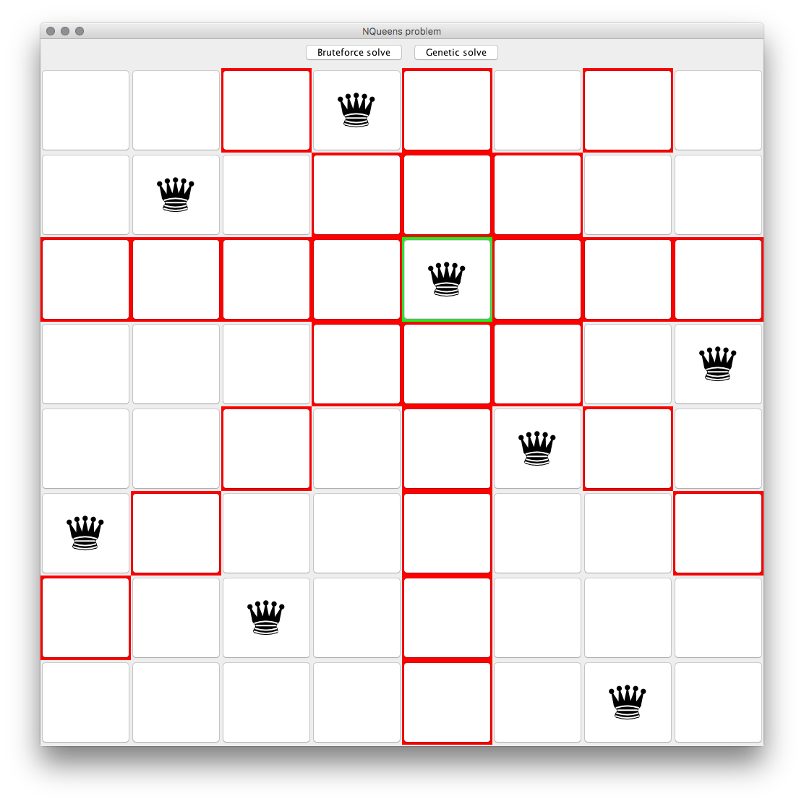

# NQueens problem

## Introduction
The NQueens puzzle is the problem of placing N chess queens on an NxN chessboard so that no two queens threaten each other. Thus, a solution requires that no two queens share the same row, column, or diagonal. Solutions exist for all natural numbers N with the exception of N=2 and N=3.

## How to solve the problem?
There are two methods of solving the problem available in this program, one is a simple bruteforce method and the other is a genetic one.

The bruteforce method will start from a state of the board and proceed to the most promising neighbor until it is stuck or finds a solution. The choice is method according to the fitness function of our problem, which here is defined as the number of conflicts present on the state. A solution of the problem has a fitness of 0, which means there are no conflicts on the board.

The genetic method will start from a population of random states, keep the better half of them (still according to the fitness function), make crossover of each pair of parents to generate a new generation (until the new generation has the same size of the old one) and mutate each member of this new population with a probability of 1/2.

## How to use the program?
At the launch of the main method of the program, you will have the choice of the size of the problem you want to solve, and then two buttons in the main window will allow you to choose the method you want to use to solve the problem. Once the solution is displayed, you can click on any of the queens to show its coverage.

